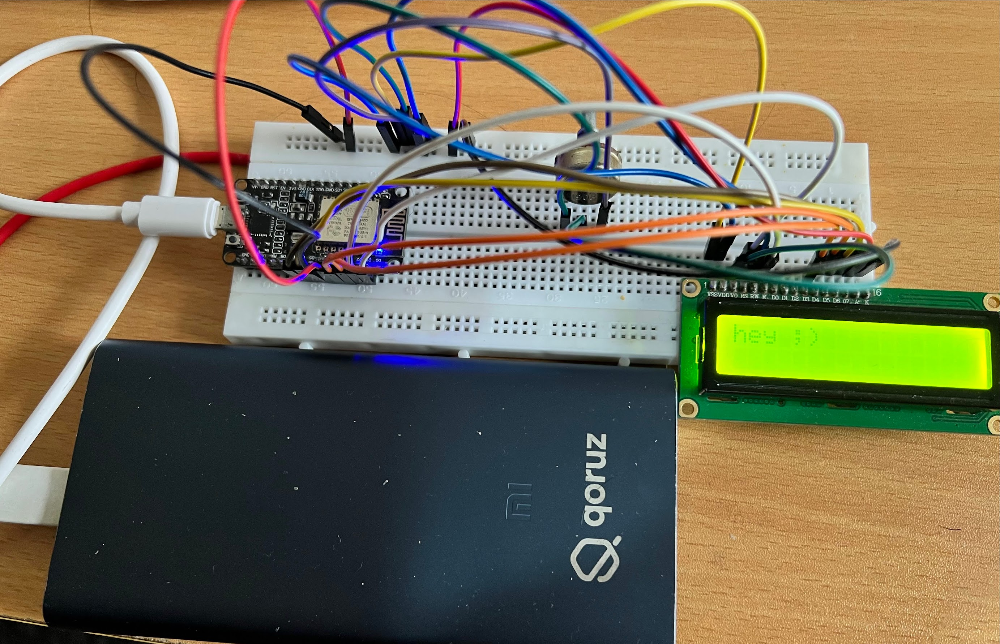

## NodeMCU Web-Controlled 16x2 LCD Display

This project demonstrates how to control a 16x2 LCD display connected to a NodeMCU ESP8266 board using a web interface. 

### Hardware Required

* NodeMCU ESP8266 board
* 16x2 LCD display with I2C or HD44780 interface
* Breadboard and jumper wires

**Optional:**

* Resistors (values depend on LCD backlight)

### Software Required

* Arduino IDE ([https://support.arduino.cc/hc/en-us/articles/360019833020-Download-and-install-Arduino-IDE](https://support.arduino.cc/hc/en-us/articles/360019833020-Download-and-install-Arduino-IDE))
* Async webserver library ([https://github.com/me-no-dev/ESPAsyncWebServer))
* Async TCP library ([https://github.com/me-no-dev/ESPAsyncTCP))

### Wiring

The specific wiring will depend on your LCD display. Here's a general guide, if you are using I2C interface, the wiring would be changed accordingly.

* rs = D1
* en = D2 
* d4 = D3 
* d5 = D4 
* d6 = D5 
* d7 = D6

**Note:** Consult your LCD display's datasheet for specific pin connections.

### Setting Up the Arduino IDE

1. Install the Arduino IDE if you haven't already.
2. Install the LiquidCrystal library by following the instructions here: [https://www.arduino.cc/en/Reference/LiquidCrystal](https://www.arduino.cc/en/Reference/LiquidCrystal)
3. Add the ESP8266 board package to the Arduino IDE:
    * Go to **File > Preferences**.
    * In the **Additional Boards Manager URLs** field, enter `http://arduino.esp8266.com/stable/package_esp8266com_index.json`.
    * Open the **Boards Manager** (**Tools > Board > Boards Manager**).
    * Search for "esp8266" and install the package by ESP8266 Community.
4. Select the appropriate NodeMCU board from the **Tools > Board** menu.

### Uploading the Code

1. Open the `**.ino**` file for this project in the Arduino IDE.
2. Update the `SSID` and `PASSWORD` variables with your WiFi network credentials.
3. Connect your NodeMCU to your computer using a USB cable.
4. Select the correct serial port from the **Tools > Port** menu.
5. Click the upload button (arrow icon) to upload the code to your NodeMCU.

### Web Interface

Once uploaded, the NodeMCU will connect to your WiFi network and start a web server. Open a web browser on your computer or phone and navigate to the IP address of your NodeMCU. 

The web page will display a text box where you can enter the message you want to display on the LCD. Click the "Submit" button to update the LCD content.

**Finding the IP Address:**

* The IP Address would be printed on the lcd.
* Alternatively, you can use a network scanner tool to find all connected devices on your network.

### Additional Notes

* This is a basic example. You can modify the code to display different types of data, like sensor readings, or implement user authentication for the web interface.
* Explore the LiquidCrystal library for additional functionalities like displaying custom characters or clearing the LCD screen.